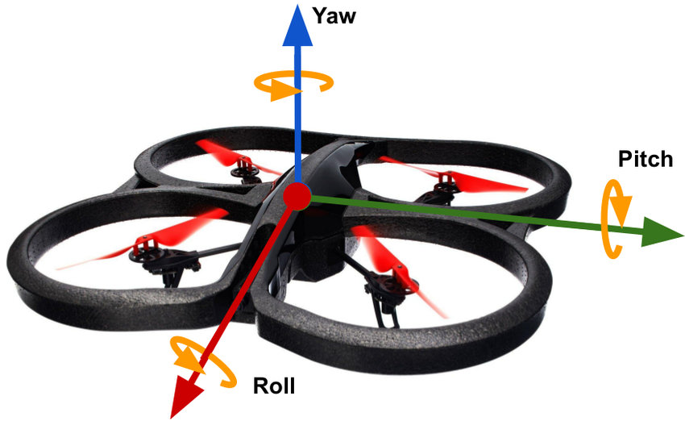
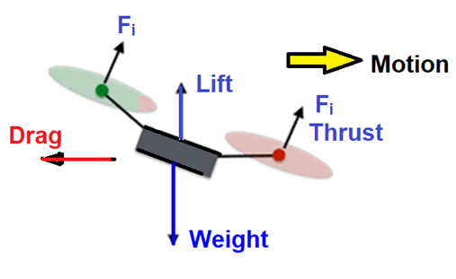
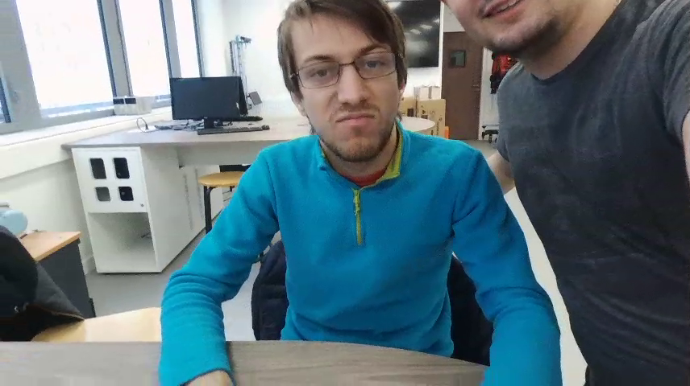

# TP Drone Bebop


## Question 1

> Quelles sont les quatre commandes classiques d’un drone quadrirotor ?

- Throttle : Changer l'axe Z, augmenter ou baisser l'altitude, ajouter de l'energie au système
- Roll : Commande le roulis, l'angle de gauche a droite, autour de l'axe X 
- Pitch : Commande le roulis sur l'axe Y, commande l'élévation
- Yaw : Commande la rotation autour de Z, commande la direction

> A l’aide de schémas et de repères que vous aurez fixés, expliquez comment
peut-on contrôler la trajectoire d’un drone quadricoptère.



le drone fournit une poussée dans une seule direction. Il utilise donc la gravité pour se maintenir en l'air. Il suffit donc d'orienter le drone dans une direction et augmenter la poussée pour le déplacer dans la direction voulue.  



## Question 2

> Quelles sont les caractéristiques techniques de votre drone Bebop 2 ?

- Camera avec stabilization verticale d'une période de 16 millisecondes
- Capteur ultrason et capteur de pression qui servent à analyser le vol.
- Gyroscope triple direction
- Acceleromètre triple direction
- Magnetometre
- GNSS pour localiser le drone

## Question 3 :
> Quels topics correspondent à la commande du drone ?

Dans la documentation, on trouve les topics :  
| Topic | Fonction | Type de message |
|--|--| -- |
| Takeoff | Fait décoller le drone | std_msgs/Empty |
| Land | Fait atterir le drone | std_msgs/Empty
| Emergency | Arrêt d'urgence | std_msgs/Empty
| cmd_vel | Controle la vitesse et la direction | geometry_msgs/Twist 


En connaissant les topics correspondant à la commande du drone, on peut afficher le type de message qu'ils utilisent pour communiquer avec `rostopic type [nom du topic]`.

## Question 4 :

En utilisant les commandes `rosrun image_view image_view image := image_raw` et `rqt_image_view`, on peut visualiser en
 temps réel la caméra du drone et afficher la tête de Mathis.

  (trouvable sur discord)

Nous voulons afficher une courbe représentant l’altitude du drone en temps réel.
> Cette altitude est disponible sur un topic. Quel serait alors le type de « plugin » rqt à
utiliser ?

On peut utiliser **rqt_plot** pour analyser l'évolution de l'altitude en tems réel.

# Partie Mini-Projet

## Question 5 :
- Proposez une spécification de commande de votre drone depuis le Joystick

## Question 6 :

> Créez dans le package « mini_projet » un nœud ROS « control.py » (si possible
en utilisant une approche en classes) capable de piloter un bebop à partir du
Joystick en suivant votre spécification.

> N’oubliez pas de coder l’atterrissage et le reset afin de ne pas avoir de drones
incontrôlables.


## Project commands 

```sh


```