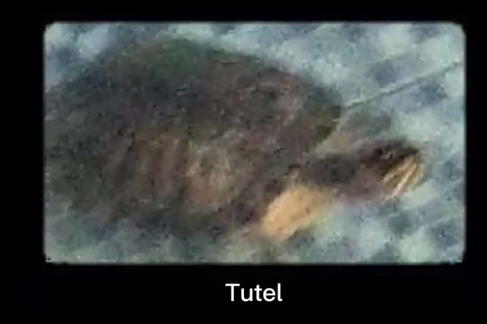

# TP Tutel

> Note
On a eu plein de soucis avec le Turtlebot qui a ralenti notre progression (shutdowns, batterie, etc...)

## Question 1

> Qu'est ce que l'odométrie ?

L'odométrie c'est les données des capteur de la centrale inertielle, avec la vitesse, orientation, acceleration...

> Que permet-elle de faire ?

L'odometrie permet de savoir les déplacement du robot, vitesse de d€placement, rotation etc...

> Est-ce suffisant pour naviguer ?

C'est suffisant pour savoir la position par rapport au départ mais pas la position réelle, ca peut manquer de précision

> Quest ce qu'AMCl ? que permet-il de réaliser ?

## Question 2

Quel outil permet de générer la carte ?
> Quelles informations sont présents sur cette carte ?

Des données de couts

> Pourquoi la carte peut se dégrader lors de déplacement trop rapide ?

L'odométrie peut manquer de précision et l'es données de la carte peuvent se superposer aux mauvais endroits, se décaler et donc perdre en qualité.

> Si une personne passe rapidement dans le champ de vision du robot lors de la création de la carte
cela perturbe t'il la création de la carte ?

Rien ne se passera car l'obstacle etait pas assez longtemps sur le terrain.

> Même question si la personne reste longtemps immobile face au robot ? Sauvegarder la carte de
l'environnement réaliser avant de passer à l'étape suivante

La carte sera mise a jour avec un nouvel obstacle détecté

## Question 3

> Qu'est ce qu'une cost map ?

La cost map est une carte de couts pour aller d'un point A a un point B. Chaque carré de la grille de la cost map represente un cout au robot pour la traverser

> Combien il y a t'il de costmap mise en jeu lors de la navigation ?

> Combien y a t'il de planner pour naviguer ?

> Quel est leur responsabilité respective ? Regarder la documentation de la couche de navigation de
ROS pour vous aider